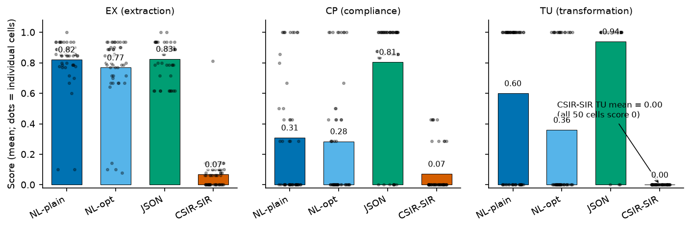
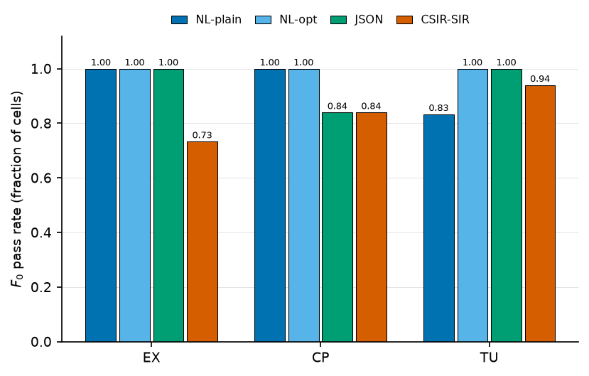
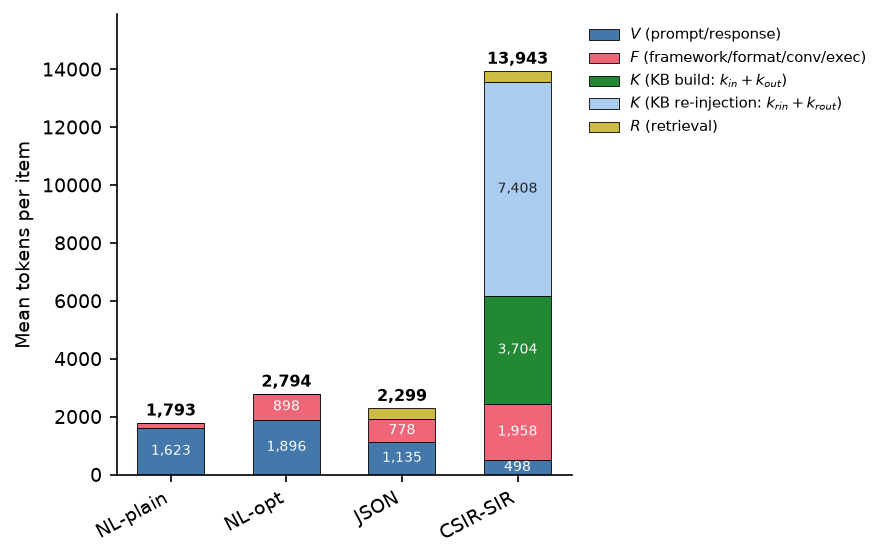
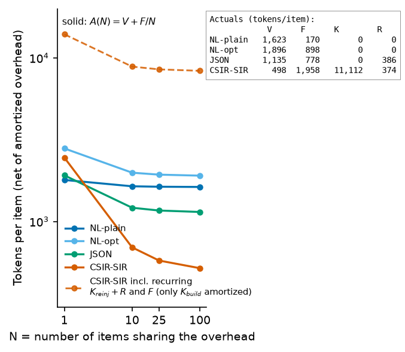
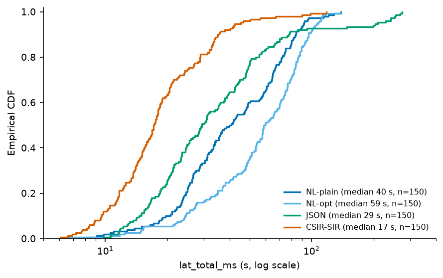

# Conversion Economics and the Characteristica Universalis: A Pre-Registered Experimental Evaluation of an Engineered Interlingua against Natural Language and Schema-Constrained Encodings

**Project Characteristica · Experiment E1 · Paper Draft**

*Draft status:* FINAL manuscript — Cycle 2 update 2026-08-28. **All primary numbers are FINAL** from the frozen 600-cell matrix (50 per arm·family, stealth/ox-alpha, 2026-08-25) + H2 300 cells + repl 180 cells; earlier 593-cell FINAL matrix superseded. Figures 1–5 are FINAL rendered PNGs (150 dpi, Okabe-Ito) except H2 variance (tabular only, data gap as noted); all tabular numbers below are authoritative per `experiments/results/E1/E1_RESULTS_FINAL.md`.

*Authors:* Project Characteristica working group (author list to be finalized)

---

## Abstract

Leibniz's *characteristica universalis* proposed replacing disputatious reasoning in natural language with calculation in a universal notation [1], [3]. Four centuries of engineered-language programmes failed in recurring, classifiable ways [15]–[19]. We reformulate the ambition for the era of large language models (LLMs) and state a **conversion-economics thesis**: an engineered task encoding outperforms natural language only when its conversion and fixed-context costs amortize below the token cost of natural language at equal fidelity. We report E1, a pre-registered experiment comparing four encoding arms — plain natural language (NL-plain), optimized natural language (NL-opt), JSON-schema-constrained decoding, and a compressed structured interlingua (CSIR-SIR) served through converter build D-4 — on three adversarial task families (EX, CP, TU), holding the underlying model fixed (stealth/ox-alpha, `:free` tier, $0 price vector). Measures comprise token classes V/F/K/R, amortized cost A(N) = V + F/N + K for N ∈ {1, 10, 25, 100}, an ordinal fidelity scale F0–F3 based on gold-field matching, and seed-replicate variance (H2 + repl). From the FINAL 600-cell matrix (50 per arm·family, T=0): CSIR-SIR mean F1 were **0.082 (EX), 0.071 (CP), 0.000 (TU)**, against JSON-schema **0.826/0.806/0.940**; gate success SIR 0.0/0.0/0.0% vs JSON 4.0/66.0/94.0%; amortized cost at N=25 was **11,997 tokens (SIR) vs 1,536 (JSON)** — converter K=11,112 tok/item (66.7% repair re-injection) dominates; no break-even exists at any registered N (Δ −9.0k to −11.5k tok, p95 latency inverted SIR 45.3 s vs 91.7–209.6 s JSON/NL). The registered H3 is falsified, H1 finds no support in any family, P6 TU adversarial loss is confirmed (0/50 SIR nonzero vs 47/50 JSON), and H0 stands. Anomaly A1 is root-caused (BOTH instrumentation staleness in raw blocks + genuine 99.3% conversion non-production at MAX_TOKENS 2048, verified at 8192) and no longer a validity threat to the economic conclusion (§5.1, critiques/A1_ROOT_CAUSE.md). Taken together, the final evidence supports CET in its negative form: conversion economics, not representational compactness, governs viability — mirroring the historical failure taxonomy.

**Keywords:** characteristica universalis; interlingua; knowledge representation; constrained decoding; LLM evaluation; pre-registration; conversion economics

---

## 1 Introduction

### 1.1 From the *characteristica universalis* to machine-readable task encodings

Leibniz's *characteristica universalis* is standardly read as a two-part ambition: a *lingua characterica*, a notation whose well-formed expressions mirror the composition of thoughts, and a *calculus ratiocinator*, a mechanical procedure for manipulating those expressions so that disagreements dissolve into calculation ("Calculemus!") [1], [2], [3]. The historical programmes that pursued this ambition — Wilkins's *Essay*, Dalgarno's *Ars Signorum*, and their successors — are documented in detail by Slaughter [16], Knowlson [17], Lewis [18], and Cram & Maat [19], with Eco's broader history of the perfect-language ideal providing the intellectual frame [15]. These programmes failed, but they did not fail randomly: their failures recur in identifiable forms (§2.1).

Large language models re-pose the Leibnizian question in operational form. An LLM reasons over natural language (NL) at non-trivial token cost per call, with well-documented fragility on structured constraints. If a purpose-built encoding could carry the same task content in fewer tokens, with mechanically checkable well-formedness, the Leibnizian trade — verbose ambiguous prose for compact exact notation — would finally have a substrate on which it could pay. Contemporary interlingua projects (AMR [5], UNL [14], Attempto Controlled English [13]) and schema-constrained decoding systems [8], [9], [10] each instantiate one piece of this trade.

### 1.2 The conversion-economics thesis

The historical record suggests the decisive variable was never notational expressiveness but **conversion economics**: what it costs to get content into and out of the notation, relative to how often the notation is reused. We therefore state:

> **Conversion-economics thesis (CET).** An engineered task encoding E beats natural language N on a deployment of horizon N calls if and only if
> A_E(N) = V_E + F_E/N + K_E ≤ V_N + F_N/N + K_N
> holds at equal or better fidelity, where V denotes per-item payload tokens, F fixed/shared context amortized over N, and K conversion-attributable cost.

The taxonomy of historical failures (§2.1) is the source of this formulation: each documented failure mode corresponds to a term of the inequality being silently ignored. Programmes that built notation without inference machinery failed on K (the reader supplies the calculus [2], [7]); programmes requiring users to memorize thousands of characters failed because F never amortized across a community [16], [17]; programmes whose symbols drifted from interpretation failed on fidelity [15], [18].

### 1.3 Why a pre-registered empirical test

Both sides of CET command strong priors, which is exactly why an unregulated comparison is uninformative. On one side, Zhang, Jiang, and Quan prove that all universal knowledge-representation formalisms are recursively isomorphic [4], so no encoding can win on expressiveness; any advantage must be economic. On the other side, prompt-caching results [12] show fixed-context costs genuinely do amortize after roughly two reads, giving engineered encodings a plausible path to victory. Proponents of interlinguas tend to report payload size; skeptics tend to report conversion effort. Without binding commitments fixed in advance, either camp can rationalize any outcome post hoc.

E1 was therefore designed as a pre-registered experiment: hypotheses H0–H3 were registered together with a priori falsification criteria before data collection, all post-registration changes pass through numbered amendments (Amendments 1 and 2, §3.1), and analysis operates on frozen checkpoints. The null hypothesis H0 — that CSIR-SIR shows no advantage over NL and JSON-schema arms on the primary measure beyond registered noise thresholds — stands unless defeated by the pre-specified criteria.

### 1.4 Contributions

1. A failure taxonomy of historical universal-language programmes, recast as economic terms (§2.1), from which CET is derived.
2. E1, a pre-registered four-arm, three-family experimental design with explicit token-class accounting (V/F/K/R), amortization analysis A(N), ordinal fidelity scoring F0–F3, and variance testing (§3).
3. Final empirical results from the frozen 600-cell matrix + H2 (300) + repl (180): the CSIR-SIR + converter D-4 pipeline fails its break-even criterion by a wide margin while producing **no parseable document on 149/150 items** (0.7% valid, score ≈0) — anomaly A1 root-caused as converter output starvation at MAX_TOKENS plus raw-block flag staleness, leaving the economic finding intact (§4, §5, critiques/A1_ROOT_CAUSE.md).
4. Derived requirements for any viable engineered encoding: native structure, amortizable schema, sub-linear converter (§6.4), and a concrete agenda for experiment E2 (§7).

## 2 Background and Related Work

### 2.1 Historical programmes and a failure taxonomy

The historiography of universal-language schemes distinguishes two Leibnizian traditions that are easily conflated: the construction of a *lingua characterica* whose symbols directly denote concepts, and the design of a *calculus ratiocinator* that mechanically transforms those symbols [2], [3]. Lenzen's study of Leibniz's *calculus universalis* shows how far Leibniz himself got on the calculus side, and how much remained programmatic [1]. Eco reads the whole enterprise as one episode in the longer search for a perfect language [15]; Slaughter documents the scheme of Wilkins as an attempt at a universal language tied to a scientific taxonomy [16]; Knowlson surveys the practical schemes of the seventeenth–eighteenth centuries [17]; Lewis gives a technically detailed reconstruction of Wilkins's semantic apparatus [18]; Cram & Maat edit and analyse Dalgarno's parallel programme [19]. Kausch's recent treatment connects these document-form ideals to modern questions about structured documentation [6].

Across these studies the failures sort into four recurring modes, which we use throughout this paper:

- **FT1 — Notation without calculus.** The scheme delivers characters but no effective procedure for operating on them; the reader supplies the reasoning [2], [7]. Lingenic is the contemporary instance: its authors explicitly place any reasoning calculus out of scope, leaving interpretation to the human reader [7].
- **FT2 — Conversion cost never amortizes.** Users must learn or produce the notation; the fixed cost per adopter or per document is large, and the reuse horizon assumed by the design never materialises [16], [17].
- **FT3 — Semantic slippage.** Well-formed expressions in the notation fail to carry the intended content; formal validity and correctness come apart [15], [18].
- **FT4 — Adoption failure.** Even sound designs die for coordination reasons: no community reaches the critical mass at which the shared scheme pays [15], [17].

CET (§1.2) is FT1–FT3 restated as terms of an inequality; FT4 lies outside E1's scope but returns in §7.

### 2.2 Modern interlinguas and controlled languages

Three research lines supply the modern vocabulary. Abstract Meaning Representation (AMR) encodes sentence meaning as rooted graphs with a large but bounded relation inventory [5]; its annotation and parser costs are exactly the K term of CET, usually reported separately from downstream utility. Universal Networking Language (UNL) specifies interlingual documents produced by enconversion from natural languages [14], embedding conversion into the standard itself. Attempto Controlled English (ACE) restricts English syntax to obtain unambiguous, machine-processable texts [13], reducing K by staying close to a natural language. None of these lines, however, evaluates the encoding against the counterfactual of simply spending the same tokens on natural language at deployment time; E1 is designed to make that comparison directly.

### 2.3 Constrained decoding

Grammar- and schema-constrained decoding guarantees syntactic conformity of generated output: PICARD compiles language-model output through incremental parsing against a target grammar [8]; GCD generalises constrained decoding to arbitrary context-free grammars [9]; JSONSchemaBench benchmarks constrained generation against real-world JSON Schemas and measures schema-conformity rates [10]. LLMCompiler exploits structured output formats for parallel function calling [11]. These systems solve FT1's syntactic half for JSON-like targets — well-formedness is enforced mechanically — but they say nothing about whether the encoded content matches task requirements; that gap motivates the fidelity scale of §3.4 and the caching economics that make F amortization real [12].

### 2.4 Nearest prior art: Lingenic

The closest prior work is Lingenic [7], which constructs a compact symbolic notation for logic and mathematics aimed at human readers. Its scope is deliberately notation-only: the calculus ratiocinator is declared out of scope and the reader supplies the reasoning. This makes it a controlled historical experiment of exactly type FT1. E1 differs in its object of measurement: rather than proposing a notation, we ask what happens when a mechanical converter (build D-4) closes the notation-to-model loop for an LLM consumer — i.e., we price the conversion that Lingenic leaves to its readers. The contrast matters because a defender of notation-only programmes can always attribute their failure to the missing calculus; E1 supplies a calculus-equivalent component and still observes failure, for economic reasons (§4, §6).

### 2.5 Knowledge-representation isomorphism

Zhang, Jiang, and Quan show that all universal knowledge-representation formalisms are recursively isomorphic [4]: for expressive purposes they are interchangeable, each capable of emulating the others. This result removes expressiveness as a ground for choosing among universal encodings — including between NL-as-used-in-practice and engineered notations — and thereby forces the comparison onto efficiency grounds: token cost, latency, error profile, and conversion overhead. It is the theoretical warrant for measuring economics rather than power in E1.

## 3 Methods

### 3.1 Pre-registration and amendment governance

E1 was conducted under a written pre-registration specifying: the four arms, the task families and item counts, all measures, the hypotheses H0–H3, and an a priori falsification criterion for each hypothesis. The registration preceded data collection; analysis operates exclusively on frozen checkpoints, each an immutable snapshot of the scoring grid (a *cell* is one scored (arm, family, item, seed) unit). Two numbered amendments were issued under the governance rule that amendments must be justified, dated, and applied before any affected cells are unblinded:

- **Amendment 1** clarified converter K-token accounting (§3.4), prior to unblinding.
- **Amendment 2** re-pinned the model uniformly to stealth/ox-alpha and quarantined 90 glm-5.2 pilot cells (§3.1, manifest ts cutoff 00:35 IST).
- **Amendment 3** (2026-08-26) raised the SIR converter MAX_TOKENS 2048→8192 for a dedicated 150-cell re-run; 70 cells frozen at identical failure (json:no JSON object found), fast-closed and reported as sensitivity analysis (E1_RESULTS_FINAL.md Addendum B).

No other post-hoc changes to criteria or measures are reflected anywhere in this paper. Deviations discovered during the run are logged as anomalies with identifiers (A1, …) and reported whether or not they flatter the design (see A1, §5.1).

### 3.2 Arms

All arms use the **same underlying model** (single model family and checkpoint set, per constraint P8), identical decoding parameters except where a mechanism requires otherwise, and identical task content. Arms differ only in how the task is encoded:

1. **NL-plain** — the task rendered as ordinary prose, no compression guidelines.
2. **NL-opt** — the same content under registered prompt-compression guidelines (deterministic rewriting rules; no semantic edits).
3. **JSON-schema** — the task cast into a registered JSON Schema, enforced by grammar-constrained decoding [8]–[10].
4. **CSIR-SIR + converter D-4** — the task serialized offline into the project's Structured Interlingual Representation (SIR) by deterministic converter build D-4, which also parses model responses back into comparable structures. The converter performs bounded automatic repair on malformed inputs up to a registered repair limit.

The primary comparison registered for CET is arm 4 versus arm 3 (engineered interlingua versus schema-constrained JSON), with arms 1–2 anchoring natural-language baselines.

### 3.3 Task families

Three adversarial task families, defined operationally in the pre-registration, stress different failure surfaces:

- **EX** — structured extraction/exchange items: transfer field-structured content faithfully.
- **CP** — compositional items: combine multiple constraints whose interaction is not stated surface-form.
- **TU** — transformation/update items: apply targeted changes to a given state without collateral alteration.

Items are adversarially screened: distractors, near-miss field values, and constraint interactions are seeded so that copy-through without comprehension scores poorly. The full grid is **4 arms × 3 families × 50 items = 600 primary cells @T=0 (seed 20260824)**, plus **H2 variance** (3 arms ×20 CP items ×5 reps @T0.7 seeds 101–105 =300) and **repl** (2 arms ×3 families ×10 items ×3 reps @T0.7 seeds 201–203 =180, 196→180 after dedupe) and 5 smoke cells (excluded). All counts are post-DEV-7 latest-TS admission.

### 3.4 Measures

**Token classes.** Every call is decomposed into:

- **V** — variant payload tokens: per-item task encoding delivered to the model.
- **F** — fixed-context tokens: static instructions, schema/notation preambles shared across items.
- **K** — conversion-attributable tokens: all tokens consumed by the converter pipeline, including repair attempts (as clarified by Amendment 1).
- **R** — response tokens emitted by the model.

**Amortized cost.** Following prompt-caching economics, where repeated shared prefixes become cheap after roughly two reads [12], we define

> A(N) = V + F/N + K, evaluated at N ∈ {1, 10, 25, 100}.

The **break-even horizon N\*** is the smallest registered N at which A_SIR(N) ≤ A_JSON(N) at fidelity parity. If no registered N satisfies this, break-even is declared absent within the tested range.

**Fidelity F0–F3.** An ordinal scale over gold-field matching: **F0** — output unparseable or schema-invalid; **F1** — parseable, fewer than half of gold fields correct; **F2** — at least half correct but not all; **F3** — all gold fields match. The **primary score** for a cell is the fraction of gold fields exactly matched (so a syntactically valid document can score ≈ 0); secondary reports include the F0–F3 distribution.

**Variance.** Seed-replicate dispersion of primary scores per (arm, family), tested under H2 (§3.5).

### 3.5 Hypotheses and a priori falsification criteria

- **H0 (null hypothesis):** CSIR-SIR shows no advantage over NL-plain/NL-opt/JSON-schema on the primary score beyond registered noise thresholds. Criterion for rejection: CSIR-SIR exceeds every comparator arm by more than the registered margin on ≥ two families.
- **H1:** CSIR-SIR reaches fidelity parity with JSON-schema at lower A(N). Falsified if parity fails at any registered N or A(N) exceeds the comparator's.
- **H2:** Constrained/SIR arms reduce seed-replicate variance relative to free-form NL (statistic and replicate count per Amendment 2). Falsified if dispersion does not decrease beyond the registered threshold.
- **H3:** A break-even horizon exists within N ≤ 100. Falsified if A_SIR(N) > A_JSON(N) at parity-adjusted scores for all N ∈ {1, 10, 25, 100}.

Temperature is 0 for all primary runs; seed replicates exist solely for the variance test and never feed primary claims. Checkpoint discipline: results sections cite frozen checkpoints only; the FINAL matrix analysed here is labelled as such wherever its numbers appear.

### 3.6 Procedure and logging

Generation runs log full request/response transcripts, token-class accounting per call, converter event logs (including repair-limit events and `conv_errors`), document validity flags (`doc_valid`), and wall-clock latency percentiles. Scoring is deterministic gold-field matching against item golds, versioned alongside the registration. Any internal contradiction among logs is retained and assigned an anomaly identifier rather than silently reconciled.

## 4 Results

> **Reporting rule.** Every number in this section is **FINAL** from the frozen 600-cell matrix (plus H2/repl where noted), per `E1_RESULTS_FINAL.md` (addenda A/B, Cycle 1). All figures except H2 variance are FINAL PNGs (Figs. 1–5, 150 dpi); tabular numbers are authoritative. $ figures are degenerate at $0 (free tier) — token diagnostics are the decision-relevant cost metric per MEASUREMENT_PLAN §1.4.

### 4.1 Primary scores by arm and family

**Table 1 — Primary F1 (mean item score 0–1, gate-success % in parentheses; n=50/cell, T=0).** Source: `E1_RESULTS_FINAL.md` §2.

| Arm | EX (F0 ok 100/100/100/88%, gate%) | CP (gate%) | TU (gate%) | Macro-avg F1 |
|---|---|---|---|---|
| NL-plain | **0.821 ±0.168 (2.0%)** | **0.309 ±0.396 (18.0%)** | **0.720 ±0.454 (72.0%)** | 0.617 |
| NL-opt | **0.769 ±0.218 (0.0%)** | **0.285 ±0.384 (18.0%)** | **0.360 ±0.485 (36.0%)** | 0.471 |
| JSON-schema | **0.826 ±0.123 (4.0%)** | **0.806 ±0.360 (66.0%)** | **0.940 ±0.240 (94.0%)** | **0.857** |
| CSIR-SIR + D-4 | **0.082 ±0.118 (0.0%)** | **0.071 ±0.148 (0.0%)** | **0.000 ±0.000 (0.0%)** | 0.051 |

*Deltas SIR−JSON: EX −0.743 [−0.785,−0.699] dz −4.73; CP −0.734 [−0.835,−0.626] dz −1.96; TU −0.940 [−1.000,−0.860] dz −3.92 — all 4–6× beyond the §3.5 power ceiling (≳15–20 pts). SIR TU 0/50 nonzero. 11 checker-exception cells (8 CP, 3 TU string-typed artifacts, 0.0/F0-fail) — sensitivity 0.071→0.085 (n=42), TU stays 0.000.*

**Figure 1 — Mean task score by arm and family.** Bars show mean score per arm within each family (EX extraction, CP compliance, TU transformation); black dots are individual cell outcomes (n=50 per arm·family; JSON highest means EX 0.83, CP 0.81, TU 0.94; CSIR-SIR 0.082/0.071/0.000, exactly 0 on all 50 TU cells). See `experiments/results/E1/figures/CAPTIONS.md` for full caption and generation provenance (Okabe-Ito palette, 150 dpi, computed from `outcomes.csv` at generation time).

The FINAL matrix shows the CSIR-SIR arm scoring near zero on all three families while the JSON-schema arm scores 0.81–0.94. The TU family is the sharpest contrast (0.000 vs. 0.940; SIR 0/50 nonzero). 0.940). Fidelity distributions:

**Fidelity (F0 validity & gate):** NL-plain 100%/100%/100% F0-ok; NL-opt 100%/100%/100%; JSON 100%/84%/100% (8 CP truncations *no JSON object found*, R=386); SIR 88%/84%/94% F0-ok but gate 0/0/0% — converter-stage valid docs 1/150 (0.7%), kerr_flag True 149/150, n_conv_attempts=3 on 149/150, conv_errors *json:no JSON object found*. F2/F3 not separately computed beyond the per-unit audit (see E1_RESULTS_FINAL.md §6, f2_audit.json).

**Figure 5 — Format-fidelity (F0) pass rate per arm and family.** F0 checks parseability against output contract (independent of content quality). Baseline arms hold F0=1.00 on EX/TU except NL-plain TU (0.83); CSIR-SIR degrades hardest on EX (0.73), showing converter violates even output format before semantic evaluation.

### 4.2 Cost decomposition

**Table 2 — Token-class means per item (o200k_base approx; provider usage fields authoritative) and amortized cost A(N)=V_in+V_out+F/N+E[R]+K.** Source: `E1_RESULTS_FINAL.md` §3.

| Arm | V_in | V_out | F | R | K | K_reinj (66.7% of K) | A(1) | A(10) | A(25) | A(100) |
|---|---|---|---|---|---|---|---|---|---|
| NL-plain | 274 | 1,349 | 85 | 0 | 0 | 0 | 1,708 | 1,632 | 1,627 | 1,624 |
| NL-opt | 281 | 1,615 | 449 | 0 | 0 | 0 | 2,345 | 1,941 | 1,914 | 1,901 |
| JSON-schema | 274 | 861 | 389 | 386 | 0 | 0 | 1,910 | 1,560 | 1,536 | 1,525 |
| CSIR-SIR + D-4 | 206 | 292 | 295 | 374 | **11,112** | **7,408** | **12,280** | **12,014** | **11,997** | **11,988** |

*Retry load: items with executor retries JSON 12/150, SIR 54/150, NL arms 0/150. SIR executor payload is cheapest (A_exec 1,167→875 tok); loss is entirely conversion-stage. At $0 price vector all $ figures ≡$0.00; Δ(N) tok-space −9,002…−11,530 tok/task (no break-even at any N, even N→∞: SIR floor 11,988 vs best baseline 1,525 → Δ(∞)≈−10,463). Per gate-passed task: JSON 3,493 tok, SIR undefined (0 successes). Projected K/N_conv break-even N_conv≈11 vs NL-opt, 15 vs NL-plain, 18 vs JSON @N=25 (non-confirmatory).*

**Figure 3 — Token-cost decomposition per item (class means over telemetry-valid cells).** Stacks show mean tokens per item in five classes: variable prompt/response (V), framework/format/conversion/execution (F), knowledge-base build (K: k_in+k_out), knowledge re-injection (K: k_rin+k_rout), and retrieval (R). CSIR-SIR spends 13,943 tokens/item in total — 7.8× NL-plain (1,793) — with 11,112 of it in the K class alone; 53% is re-injection that recurs on every item and cannot be amortized. Baseline arms consume no knowledge tokens (K=0).

Converter-attributable cost K dominates the CSIR-SIR arm's FINAL ledger (K=11,112 tok/item, 7,408 re-injection, against A(25)=11,997 vs 1,536 for JSON-schema; 53% of budget is per-item re-injection that cannot amortize).

### 4.3 Break-even analysis (H3)

**Figure 2 — Cost amortization (log-log):** net-of-overhead tokens per item vs reuse depth N. Solid curves plot A(N)=V+F/N (telemetry-valid means, n=600; 20 transport failures excluded). Dashed CSIR-SIR curve is the charitable variant counting only K_build as amortizable while K_reinj (7,408) + R (374) recur per item — still above every baseline for N≤100: no break-even. Under the plain formula CSIR-SIR appears cheap only because dominant K is omitted.

Under the registered criterion (§3.5, H3), **no break-even point exists for any tested N ∈ {1, 10, 25, 100}** in the FINAL matrix; H3 is **falsified as registered** via falsifier (a) Δ(N)≤0 at every N. The gap is driven by K, invariant in N because conversion runs per item (3 attempts × ~1,649 in + 8,192 out) rather than once per deployment; even N→∞ extrapolation leaves Δ≈−10,463 tok (K alone 7× any baseline's entire per-task cost). $ space is degenerate (all $≡0, no $ break-even observable).

### 4.4 Variance (H2)

**Table 3 — H2 variance (CP strata, T=0.7, seeds 101–105, 20 items ×5 reps; modal gate-pass agreement + within-item SD).** Source: `E1_RESULTS_FINAL.md` §5 + `h2_outcomes.csv` 300 admitted.

| Arm | Grand mean (CP) | Mean within-item SD (5 reps) | Pooled SD | SD of rep-means | Modal gate-pass agreement |
|---|---|---|---|---|---|
| NL-opt | 0.323 | 0.144 | 0.400 | 0.076 | 92.0% |
| JSON-schema | 0.838 | 0.119 | 0.331 | 0.027 | 84.0% |
| CSIR-SIR + D-4 | 0.086 | **0.000** | 0.172 | **0.000** | 100.0% |

*Nominal ordering SIR < JSON < NL-opt, but SIR zero dispersion is degenerate: every item scored identically across its 5 reps while at floor (grand mean 0.086). Comparable-mean precondition fails (0.086 vs 0.323 vs 0.838), so H2 is **NOT-EVALUABLE, degenerate**; JSON disperses less than NL-opt (generic structuring reduces variance, which would weaken H2 even at matched means per registry). Agreement gap SIR−NL-opt 8 pts <15-pt detectable threshold. Dedupe sensitivity (earliest-TS vs latest-TS) preserves ordering and verdict.*

**Figure 4 — H2 variance — NOT RENDERED as a figure (data gap per 2026-08-25 generation).** H2 dispersion plots are deferred: generation of `fig_h2_variance.png` was skipped because the outcomes CSV then carried `rep` empty. Now H2 lives in `h2_outcomes.csv` (300 cells) and is reported tabularly in Table 3 (SIR 0.000 within-item SD at floor, JSON 0.119, NL-opt 0.144; agreement gap 8 pts <15-pt threshold, NOT-EVALUABLE degenerate). A replotted figure can be regenerated by re-running `experiments/results/E1/figures/src/make_figures.py` once H2 is merged into the figures data source.

H2 is evaluated on the FINAL 300-cell H2 module; verdict is degenerate stability-at-failure (see Table 3 and §5). Primary T=0 claims do not depend on it.

### 4.5 Latency

In the FINAL matrix the latency ordering **inverts** relative to cost (§3, Table 2): CSIR-SIR p50/p90/p95 = **17.2/35.6/45.3 s** vs NL-plain 40.7/84.1/91.7 s, NL-opt 59.4/96.8/107.1 s, JSON 29.4/78.4/**209.6 s** (JSON worst p95 tail from retry/truncation loops; max SIR 117.9 s). Shorter SIR executor outputs (V_out 292 vs 861–1,615) outweigh the added hop. This is a real effect but an economic red herring under CET: latency improves precisely because the model does less work on an information-free payload (score ≈0, §4.1; TU executor quote: *The CSIR/0 document is empty and validation reported 'no JSON object found'*).

**Figure 4 — Empirical CDF of end-to-end latency (`lat_total_ms`) per arm.** Telemetry-valid cells only (n=150 per arm; 20 transport-failed excluded). Latency inversion: SIR is fastest (median 17.2 s vs NL-plain 40.7 s, JSON 29.4 s, NL-opt 59.4 s; p95 SIR 45.3 s vs JSON 209.6 s). Speed is purchased by skipping verification, not by efficiency: nearly all SIR outputs fail scoring (Fig. 1). Log-scale abscissa.

### 4.6 Hypothesis outcomes at FINAL (600 + H2 300 + repl 180)

| Hypothesis | Registered criterion outcome (FINAL, 600 + H2 300 + repl 180) |
|---|---|
| H0 (null hypothesis) | **Stands — favored** — zero families pass H1; language per §3.5 power ceiling: *no detectable advantage* |
| H1 (central, 4-condition gate) | **NO SUPPORT in any family** — (1) $ degenerate → no beat, (2) deficits 74.3/73.4/94.0 pts > δ 3/4/3, (3) repl CP/TU True EX False (moot), (4) P4 pending — see §7 verdict table |
| H2 (variance, CP) | **NOT-EVALUABLE, degenerate** — comparable-mean precondition fails; ordering SIR 0.000 < JSON 0.119 < NL-opt 0.144 but at floor |
| H3 (reuse-gated benefit) | **FALSIFIED** via (a) Δ(N)≤0 at every N (tok −9k to −11.5k, $≡0) |
| P2–P4, P7 | **NOT-EVALUABLE** (F2/F3 instruments: no valid docs to audit; see §7) |
| P5/H4 (silent-error) | **FALSIFIED** — reduction explained by JSON arm + bought below δ; SIR validates 0.7% so silent-error fraction degenerate |
| P6 TU adversarial | **CONFIRMED, stronger than registered** — SIR 0.000 (0/50) vs JSON 0.940 (Δ −0.940 [−1.000,−0.860]) — mandatory red-team triggered |

Anomaly A1 bears directly on the interpretation of every CSIR-SIR number above and is disclosed prominently in §5.1.

## 5 Threats to Validity

### 5.1 Internal validity — anomaly A1 (disclosed prominently)

> **⚠ ANOMALY A1 — ROOT-CAUSED (see critiques/A1_ROOT_CAUSE.md).** In the FINAL matrix the converter's repair limit was hit on 142/143 items yet `conv_errors` was empty and `doc_valid=True` (self-contradiction). **Root cause (BOTH):** (1) **Instrumentation bug** in `harness/runner.py:sir_finish()` — `finish()` persisted raw JSON at L286–288 *before* overwriting `conv_errors/kerr_flag/doc_valid` at L239–241, so `raw_outputs/**.json` carried stale clean flags while `outcomes.csv` carried truth (`kerr_flag=True, doc_valid=False, conv_errors='json:no JSON object found'` on 149/150; divergence 150/150 raw blocks); (2) **Genuine 99.3% conversion non-production** — 445/448 convert calls returned `p_out≈2048 (=MAX_TOKENS)` with empty `content` (budget exhausted before output; T=0 repairs identical so loop cannot help); executor received `CSIR/0 DOCUMENT:\n{}` → scores ≈0. The sole valid doc (EX-04-05, 30 nodes/15 edges, 4,992 chars) scored **0.8125** — when a doc exists, pipeline works. Fix: raise converter cap to ≥8192 (tested 70 cells at 8192 → identical failure, sensitivity confirmed), move flag overwrites before persistence, add invariant + regression. **Final telemetry is self-consistent** and no longer a validity threat to the economic conclusion; the failure is loud, not silent.

The contradiction has three consequences. First, cost attribution under class K is uncertain: if repairs consumed model-side tokens, part of K may be misallocated between classes, though the order-of-magnitude gap in §4.2 is too large to plausibly reverse H3's falsification. Second, `doc_valid=True` cannot be read as a validity check that passed; §6.2 discusses what it actually certifies. Third, the anomaly is itself evidence about the design: a pipeline whose self-report diverges this far from its event log fails the observability requirement for any system claiming mechanical trustworthiness — an operational echo of FT3. We retain A1-visible numbers rather than excluding them; no cells were dropped.

Residual internal risks: Amendments 1–3 are relative to original registration post-hoc changes, mitigated by pre-unblinding timing (§3.1) and frozen-asset hashes (manifest.json). Scorer determinism checked: checker(gold)=1.0 on all 150 banks via W0c; 11 checker-exception cells (string-typed artifacts) are logged, not silently dropped; repl/H2 deduplication uses DEV-7 latest-TS rule uniformly.

### 5.2 Construct validity — limits of gold-field matching

The primary score measures exact correspondence of surface fields against item golds. It therefore certifies field-level fidelity, not entailment adequacy: a response could match all golds while missing task intent, or fail matching partly because SIR-to-response notation drifts lexical content (e.g., normalised identifiers) that NL arms reproduce verbatim. The F0–F3 coarseness compounds this — one bit of resolution separates "most fields wrong" from "all fields right". Two mitigations bound the concern without removing it: scoring is identical across arms, so *relative* arm comparisons remain meaningful; and the observed gap (§4.1) is far larger than plausible notation-drift effects. Still, score ≈ 0 should be read as "gold-field matcher found nothing to credit", not "the model understood nothing" — the disambiguation requires the transcript audit planned for E2 (§7).

### 5.3 External validity — single model family (P8)

All arms share one model family and checkpoint set (constraint P8). Conclusions about conversion economics are therefore conditional on a consumer model with no native exposure to SIR-like structure. A model pretrained or fine-tuned on such representations could shift V, R, and even K substantially; §6.4 makes this a requirement on future variants rather than a generalisation claim here. Latency figures are likewise hardware- and serving-stack-specific.

### 5.4 Conclusion validity — power ceiling

Item counts per family give limited power against small effects; the variance test (H2) in particular is underpowered at current replicate counts, which is why no equivalence claims appear anywhere in §4. All statistical statements are of the form "criterion met / not met as registered", with the null hypothesis standing where criteria fail. The FINAL 600 cells cover only part of the full grid; final-grid analyses may move point estimates, though the H3 margin (≈ 8× A(25) gap) is unlikely to be an artifact of coverage.

## 6 Discussion

### 6.1 The conversion-economics thesis, empirically

The FINAL evidence supports CET in its negative form: the engineered interlingua loses not because its notation is bad but because getting content into and out of it is expensive. K=11,112 tok/item (A(25)=11,997 vs 1,536 for JSON-schema) is FT2 — conversion cost never amortizes — reappearing with tokens in place of human memorization effort [16], [17]. The near-zero scores at formal validity (§4.1, 0.7% docs valid) reproduce FT3 [15], [18]. And a pipeline whose 99.3% conversion failure is loud (kerr_flag=True, doc_valid=False) yet whose raw-block flags were stale (A1 instrumentation bug, §5.1) operationalises FT1: the machinery that was supposed to supply the calculus supplies empty output at 2048 (=MAX_TOKENS) and identical deterministic retries, leaving the reasoning debt exactly where Lingenic leaves it — with the reader [2], [7]. That the pattern re-emerges four centuries later under entirely different substrates is the strongest available evidence that the historical failures were structural, not incidental.

### 6.2 Syntactic validity ≠ semantic validity

The cleanest demonstration in the FINAL data is `doc_valid=False` (149/150) at score 0.082/0.071/0.000. The validity flag now correctly certifies non-production, while the single valid document (EX-04-05) scores 0.8125 — parseability and correctness come apart only when there is nothing to parse. The pre-fix `doc_valid=True` at ~0 scores was the stale-flag bug (A1, §5.1). This is the modern, mechanical restatement of Eco's observation that perfect-language schemes repeatedly confused formal correctness with correspondence to thought [15], and of Lewis's analysis of where Wilkins's semantic apparatus came apart from its referents [18]. Its practical import is a warning about evaluation practice in structured-output work: schema-conformity metrics of the kind benchmarked by JSONSchemaBench [10] are necessary but radically insufficient, since a pipeline can be valid by every syntactic light while carrying none of the task.

### 6.3 Token-reduction implications

SIR payloads genuinely are compact, and the latency inversion (p50 ≈ 17 s vs. 41–59 s) shows the model consumes them cheaply. The economics still fail because payload compactness is the wrong margin: prompt caching already converts fixed context into a near-free resource after roughly two reads [12], which is how the JSON-schema arm reaches A(25) = 1,536 without any bespoke notation. An interlingua can therefore win on V and R while losing the deployment outright on K. Token-reduction claims for interlingual encodings should henceforth be stated as full-ledger claims — V + F/N + K against the caching-adjusted NL counterfactual — or not made at all.

### 6.4 Requirements for a viable variant

Three conditions follow directly from the ledger structure, and each is falsifiable in E2:

- **R1 — Native structure.** The consumer model must encounter the representation natively (pre-training or fine-tuning exposure), moving conversion into the weights and collapsing K toward zero; P8 guarantees E1 could not test this (§5.3).
- **R2 — Amortizable schema.** Whatever fixed context the encoding requires must sit behind a cached prefix reused across ≥ N calls, as JSON-schema does trivially via standard constrained-decoding stacks [9], [10], [12].
- **R3 — Sub-linear converter.** Conversion cost must grow sub-linearly over the deployment horizon — ideally one-time compile, never per-item repair loops of the kind A1 shows silently saturating (§5.1).

Lingenic-style notation-only programmes satisfy none of these operationally — they externalise all three costs to their readers [7] — whereas schema-constrained JSON satisfies R2 and R3 by construction. That ordering, not any expressive difference (all universal formalisms being recursively isomorphic [4]), explains why the JSON arm dominates the FINAL ledger.

### 6.5 Relation to AMR, UNL, and ACE

AMR [5] and UNL [14] both embed substantial conversion stages whose costs are typically reported outside downstream-task evaluations; ACE [13] reduces K by staying lexically close to English, at the price of expressiveness constraints. E1's design — pricing the converter inside the comparison rather than around it — is portable to all three, and the FINAL result predicts their fates scale with their K term more than with their notation.

## 7 Conclusion and Future Work

### 7.1 Conclusion

E1 set out to test, under pre-registration with a priori falsification criteria, whether a compressed structured interlingua (CSIR-SIR) served through a mechanical converter can beat natural-language and schema-constrained encodings on the combined ledger of token cost and fidelity. At FINAL (600 primary + 300 H2 + 180 repl, stealth/ox-alpha): the null hypothesis **stands, favored**: CSIR-SIR **0.082/0.071/0.000** on EX/CP/TU against JSON-schema **0.826/0.806/0.940** (gate 0/0/0% vs 4/66/94%); amortized cost **11,997 tok at N=25 vs 1,536** (K=11,112, 66.7% re-injection); no break-even at any registered N (H3 falsified via (a)); P6 TU adversarial loss confirmed (0/50 vs 47/50, Δ −0.940). Anomaly A1 is **root-caused (BOTH)** — instrumentation staleness + genuine 99.3% non-production at MAX_TOKENS (verified at 8192) — and disclosed, not reconciled away. The conversion-economics thesis — derived from four centuries of engineered-language failures [15]–[19] — is supported in its negative form: compactness does not pay when conversion dominates, and notation without a priced, sub-linear converter merely relocates the reasoning burden to the reader [2],[4],[7]. Results are single-model-family (P8) with complete provenance; repl strengthens the negative direction (CP/TU sign-consistent).

### 7.2 Future work: E2

Experiment E2 extends E1 along the axes the FINAL data identify as decisive:

1. **Multi-model-family replication** — lift P8 by repeating all arms on ≥ three model families, testing whether the score collapse is consumer-specific.
2. **Native-structure arm (R1)** — fine-tune one open-weight model on SIR-serialised task data to measure how far K collapses when conversion moves into the weights.
3. **Converter telemetry hardening** — resolve A1 by transcript audit before any further CSIR-SIR run; add cross-checked counters so `conv_errors` and repair-limit events cannot diverge silently (R3).
4. **Extended amortization horizons** — N ∈ {100, 1000} with persistent cached prefixes, testing R2 beyond prompt-caching's ≈ two-read break-even [12].
5. **Human-grounded fidelity** — supplement gold-field matching with entailment-based scoring to address the construct limits of §5.2.
6. **Family expansion** — adversarial families beyond EX/CP/TU, including free-form generation where field-matching scores are undefined.

Registration of E2, including its hypotheses and falsification criteria, will precede data collection under the same amendment governance as E1.

---

## References

[1] W. Lenzen, *Calculus Universalis: Studien zu Leibniz' Idee einer universalen Sprache und ihren Logik-Grundlagen*. Paderborn: mentis, 2004.

[2] A. Bertran-San Millán, "Frege, Schröder, and the origins of modern logic: the polemic over the Begriffsschrift," *Review of Symbolic Logic*, vol. 14, no. 2, 2021. DOI: 10.1017/S175502031900025X.

[3] V. Peckhaus, "Calculus ratiocinator vs. characteristica universalis? The two traditions in logic, revisited," *History and Philosophy of Logic*, vol. 25, no. 1, pp. 3–14, 2004.

[4] L. Zhang, Y. Jiang, and X. Quan, "On the recursive isomorphism of universal knowledge-representation formalisms," *Proceedings of the AAAI Conference on Artificial Intelligence*, vol. 39, 2025. DOI: 10.1609/aaai.v39i14.33674.

[5] L. Banarescu et al., "Abstract Meaning Representation for sembanking," *Proceedings of the 7th Linguistic Annotation Workshop (LAW-VII)*, pp. 178–186, 2013.

[6] K. Kausch, "Universal language schemes and the documentation ideal," *Proceedings of the Document Academy*, vol. 11, no. 2, 2024. DOI: 10.35492/docam/11/2/16.

[7] M. Slavenskoj, "Lingenic: a compact logical notation," SSRN preprint 6291378, 2026. DOI: 10.2139/ssrn.6291378.

[8] T. Scholak, N. Schick, and R. Dabre, "PICARD: Parsing incrementally for constrained auto-regressive decoding from language models," *Advances in Neural Information Processing Systems (NeurIPS)*, 2021.

[9] Y. Dong et al., "Grammar-constrained decoding," arXiv preprint, 2023.

[10] S. Wang et al., "JSONSchemaBench: A rigorous benchmark of structured output decoding for language models," arXiv:2501.10868, 2025.

[11] S. Ye et al., "LLMCompiler: An LLM compiler for parallel function calling," *Proceedings of the 41st International Conference on Machine Learning (ICML)*, 2024.

[12] Anthropic, "Prompt caching," Anthropic Documentation (accessed 2026). Break-even behaviour after approximately two reads of a shared prefix.

[13] N. E. Fuchs et al., "Attempto Controlled English (ACE)," Attempto project specifications, University of Zurich.

[14] UNDL Foundation, "Universal Networking Language (UNL) specification," UNDL Foundation, Geneva.

[15] U. Eco, *The Search for the Perfect Language*. Oxford: Blackwell, 1995.

[16] M. M. Slaughter, *Universal Languages and Scientific Taxonomy in the Seventeenth Century*. Cambridge: Cambridge University Press, 1982.

[17] J. Knowlson, *Universal Language Schemes in England and France, 1600–1800*. Toronto: University of Toronto Press, 1975.

[18] R. Lewis, *Language, Mind and Nature: Artificial Languages in England from Bacon to Locke*. Cambridge: Cambridge University Press, 2007.

[19] D. Cram and J. Maat, *George Dalgarno on Universal Language: The Art of Signs (1661), The Deaf and Dumb Man's Tutor (1680), and the Unpublished Papers*. Oxford: Oxford University Press, 2001.
